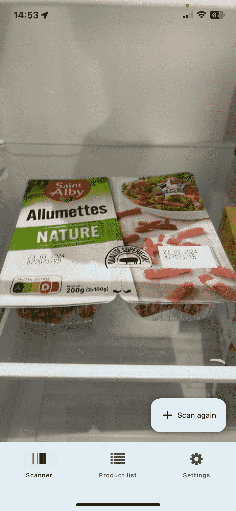
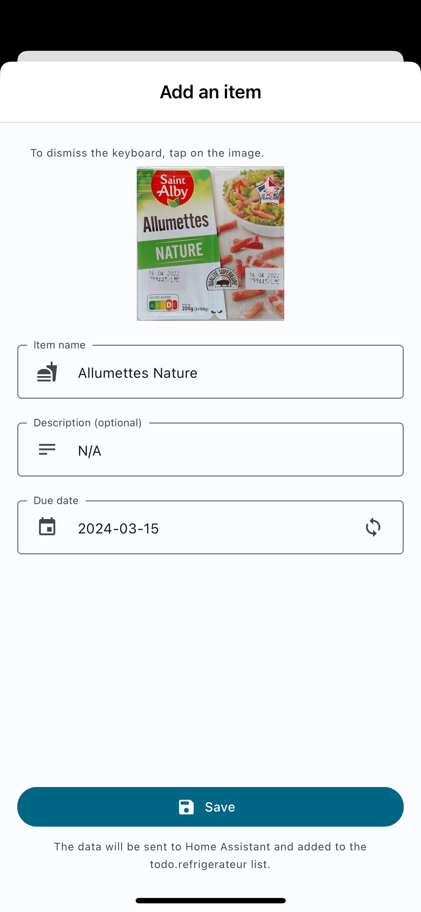
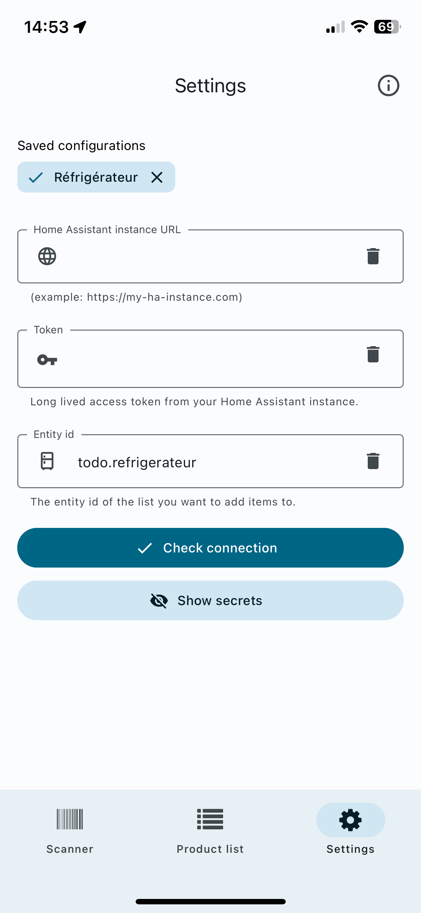

# Fridge (for Home Assistant)

  
   
  

This project is a cross-platform mobile application for Home Assistant. It allows users to scan barcodes of items in their fridge and keep track of their inventory and their due date. The application is built using React Native and Expo.

## Project Structure

The project is structured as follows:

- `app/`: Contains the main application code.
- `assets/`: Contains images and locale files for internationalization.
- `components/`: Contains reusable React components.
- `constants/`: Contains constant values used across the project.
- `hooks/`: Contains custom React hooks.
- `libs/`: Contains utility functions and libraries.

## Installation

To install the project, follow these steps:

1. Clone the repository.
2. Run `npm install` to install the dependencies.

## Running the Project

To run the project, use the command `npm start`.

## Uses

The project uses the following libraries:

- `expo-camera`: For scanning barcodes.
- `react-i18next`: For internationalization, and language switching.
- `@react-native-async-storage/async-storage`: For storing the configurations of entities/api.
- `react-native-paper`: For the UI components.
- `react-hook-form`: For form validation and management.
- `expo-router`: For navigation.

## Localization

The project supports localization. The locale files are located in `assets/locales/`. Currently, English and French are supported.

## Contributing

Contributions are welcome. Please submit a pull request or create an issue to discuss the changes.

## License

This project is licensed under the MIT License.
